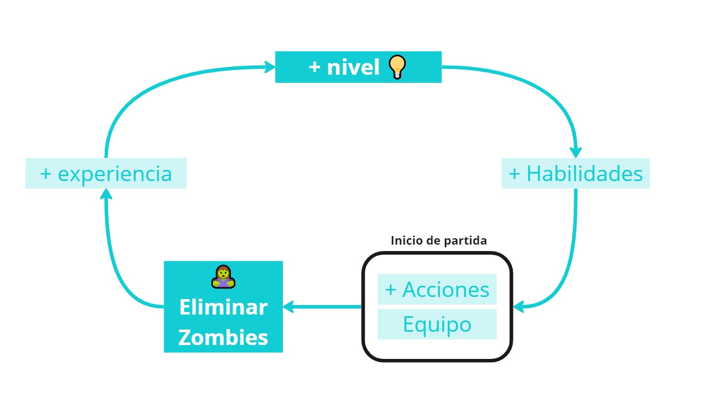
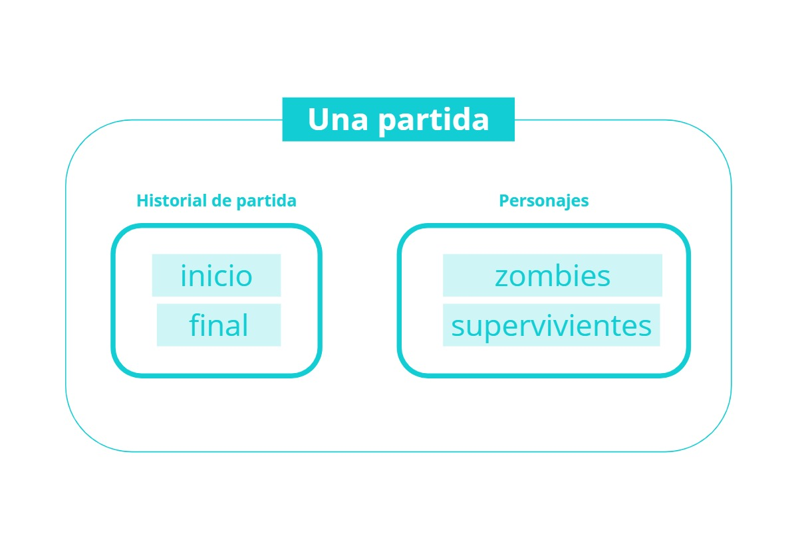
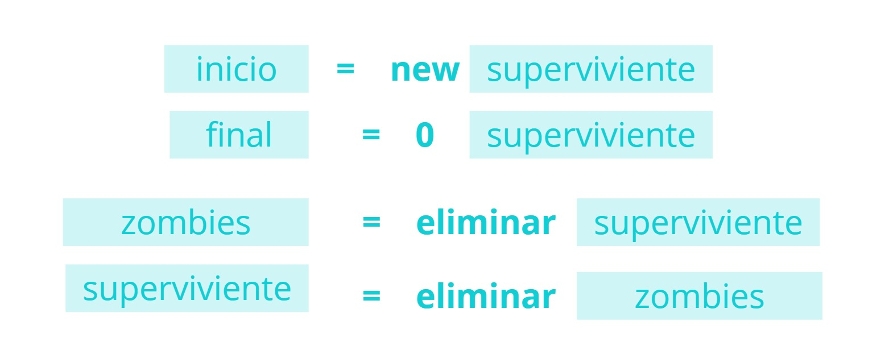
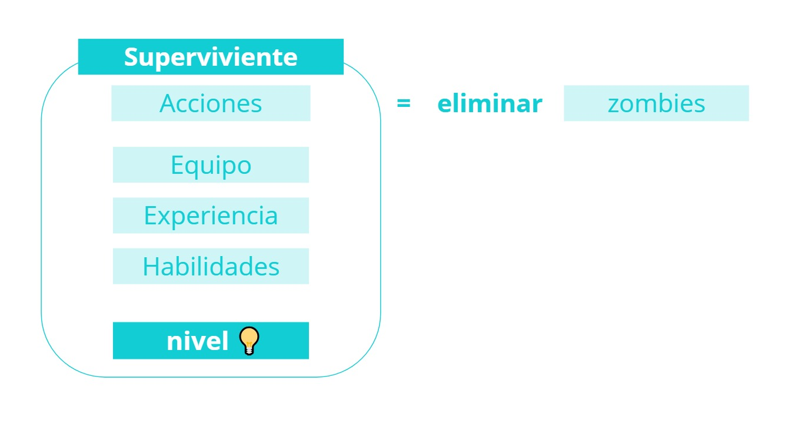
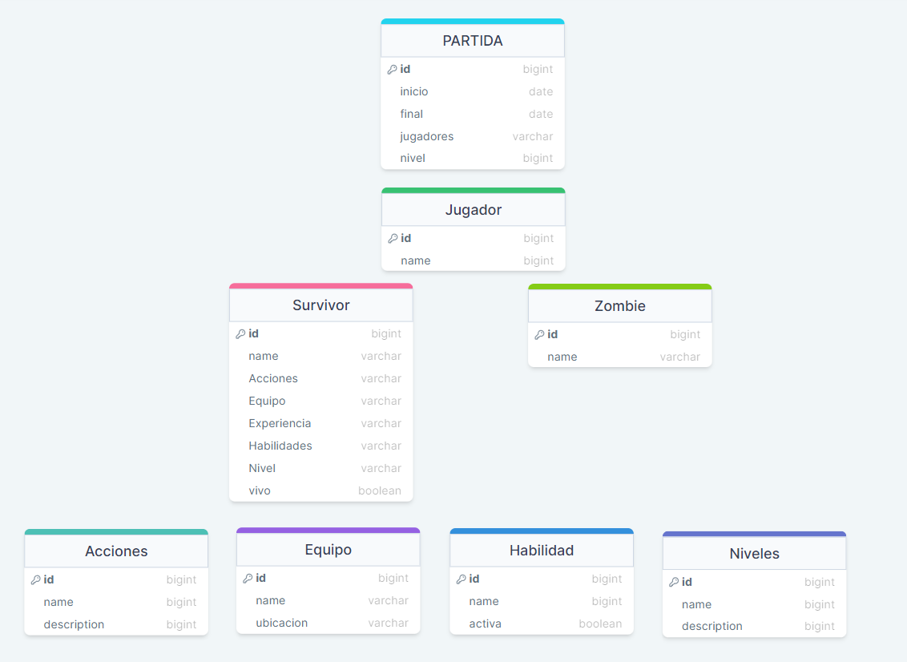

## Lógica del Juego

Para poder empezar a desarrollar un programa es necesario hacer antes un proceso de abstracción para extraer la lógica de mi negocio y apartir de ella  plantear una estructura de código clara y ordenada. 

La kata zombie, es un juego formado por partidas que tienen dos tipos de personajes, los zombies y los supervivientes, los jugadores serán los supervivientes.

Ahora pongámonos en la piel de los jugadores principales que marcaran el juego ( los supervivientes ) y tengamos claro nuestro objetivo:

```
💡 objetivo del juego: subir de nivel
```


¿Cómo subo de nivel?

```
☝ subir de nivel = más experiencia

```

¿Cómo subo mi experiencia?

```
☝ más experiencia = eliminar zombies

```

¿Cómo elimino zombies?

```
🧟‍♀️ eliminar zombies = Acciones

```

¿Cómo mejoran mis Acciones?

```
🪓  Las acciones varían en función de mi equipo y mis habilidades
```

Cuanto mejor sea mi nivel mejores serán mis habilidades y por lo tanto mis acciones



Ahora que ya tenemos claro nuestros objetivos para poder llevar todo esto a la programación necesitamos encontrar las piezas que formaran este programa

El juego es en si mismo es una partida

**¿De que consta una partida?**

Si tuviésemos que simplificarlo al máximo sería algo así:





Con este esquema ya encontramos dos clases claramente, la clase historia de partida y la clase personaje que extiende a dos subclases, la clase Superviviente y la clase Zombie.

Teniendo una visión general de todas las clases a plantear sería algo así. He utilizado una app de diagrama de sql para hacer este esquema, no es la mejor manera de hacerlo, para próximas veces es preferible otro tipo de sistema y añadir también los métodos.
Cambiar de paradigma es todo un proceso mental y mi mente aún esta en otra parte...🙃




La clase superviviente es la más compleja porque es sobre la que recae toda la acción del juego y el valor de sus atributos varia en función de la interacción con los zombies.

Si pensásemos en una partida modelo , lo primero sería crear el primer jugador que hará iniciar la partida, cuando creamos el primer jugador tendrá unos **valores por defecto**, que aplicados a una clase sería de la siguiente manera:

```jsx
class Survivor{
    constructor(name){
        this.name = name;
        this.wounds = 0
        this.alive = true;
        this.actions = ['action1', 'action2', 'action3'];
        this.equipament = [];
        this.level = 'blue';
        this.experience = 0;
        this.habilities = [];
			  this.permittedEquipment = 5;
    }

```

Las clases son capaces de crear objetos, podemos verlas como “plantillas” “moldes” para crear objetos en base a su estructura. Crear un nuevo objeto a partir de una clase es lo que se denomina instanciar, vamos a suponer que queremos crear una superviviente que se llama juanita, `const juanita = new Survivor(’juanita’)` juanita es una instancia de la clase Survivor

Bien ahora que ya conocemos nuestra nueva clase y vemos todos los atributos que la conforman tenemos que tener en cuenta que necesitamos que estos valores varíen entre sí en función de las diferentes interacciones que realice el superviviente,  esta capacidad de poder interaccionar, se la vamos a implementar a través de los métodos.

los métodos son funciones dentro de nuestras clases y pueden realizar acciones y cambios sobre los valores de si misma.

```jsx
class Survivor{
    constructor(name){}

    injure(atackNumber){
        if(atackNumber === undefined){
        this.wounds++;
        this.permittedEquipment--;
        this.equipament.pop()

        } else {
            this.wounds += atackNumber;
        }
        if(this.wounds >= 2){
            this.alive = false;
        }
    }

    addEquipament(equipament){
        if(this.equipament.length < this.permittedEquipment){
            this.equipament.push(equipament)
            console.log(`The maximum number of pieces of equipment is ${this.permittedEquipment}`);
        }
    }

    removeEquipament(equipament){
        this.equipament = this.equipament.filter(e => e !== equipament);
    }

    levelUp(){
        if(this.experience >= 6){
            this.level = "yellow";
        }
        if(this.experience >= 18){
            this.level = "orange";
        }
        if(this.experience >= 42){
            this.level = "red";
        }
    }

    killZombie(){
        this.experience++;
        levelUp();
    }

    addHability(hability){
        this.habilities.push(hability);
    }

    removeHability(hability){
        this.habilities = this.habilities.filter(h => h !== hability);
    }

    useAction(action){
        this.actions = this.actions.filter(e => e !== action);
    }


```

Lo que encontramos aquí es un planteamiento inicial en Js que más tarde refactorizaré dentro de mi proceso de desarrollo con TDD, para este proceso de abstración mientras hacemos el dominio no es necesario hacer una traducción tan literal al código, debería ser algo más esquematico sin tanto detalle y dejando claro cuales serán los atributos y métodos de cada clase.